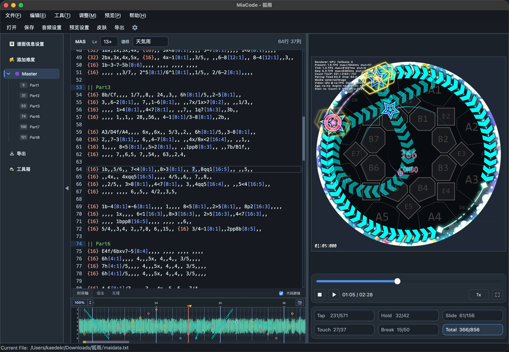
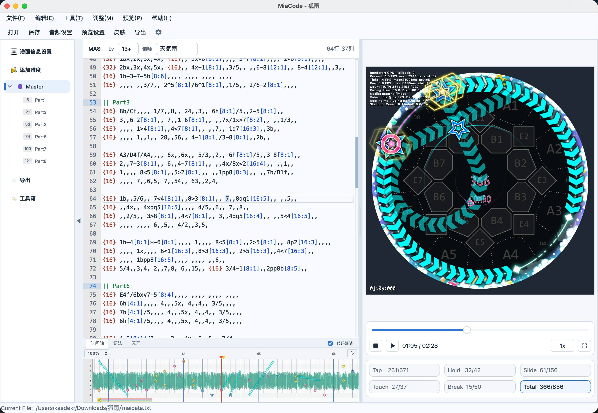
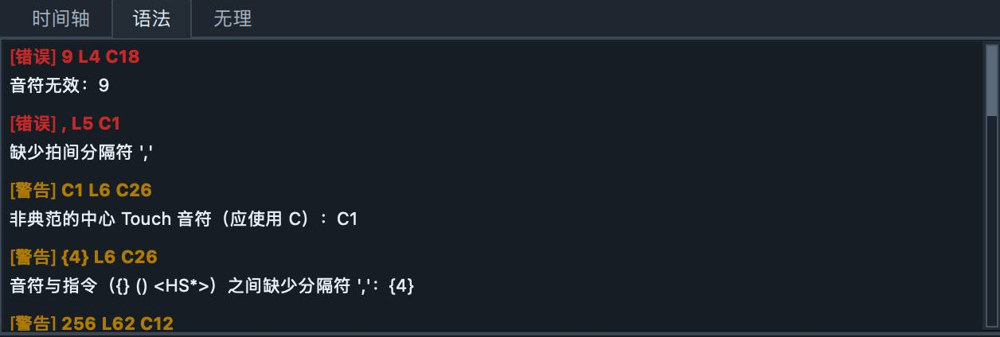
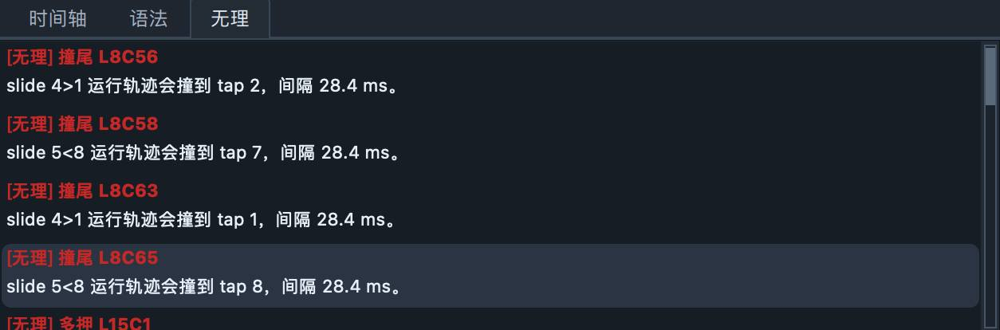
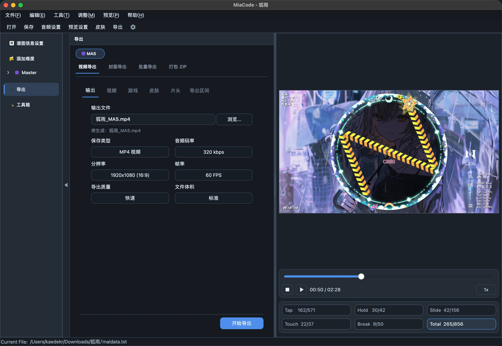
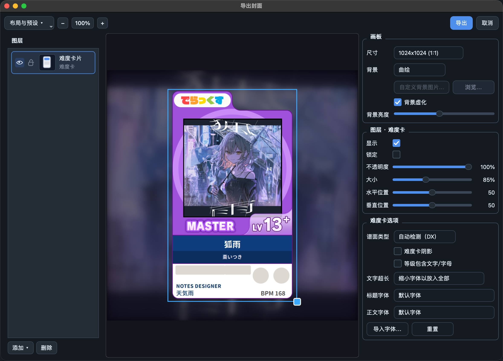
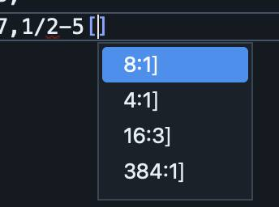
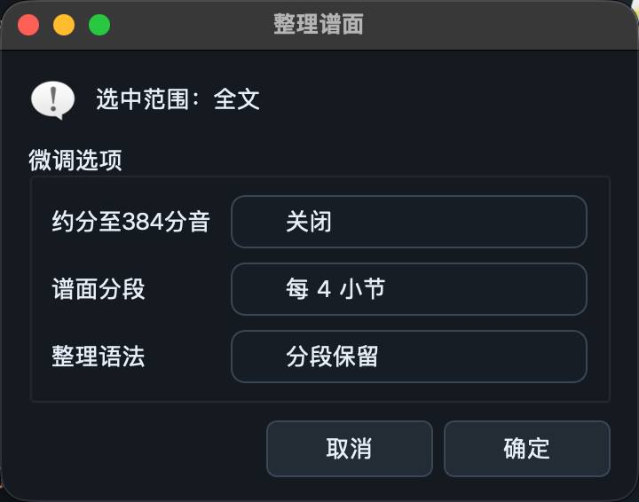
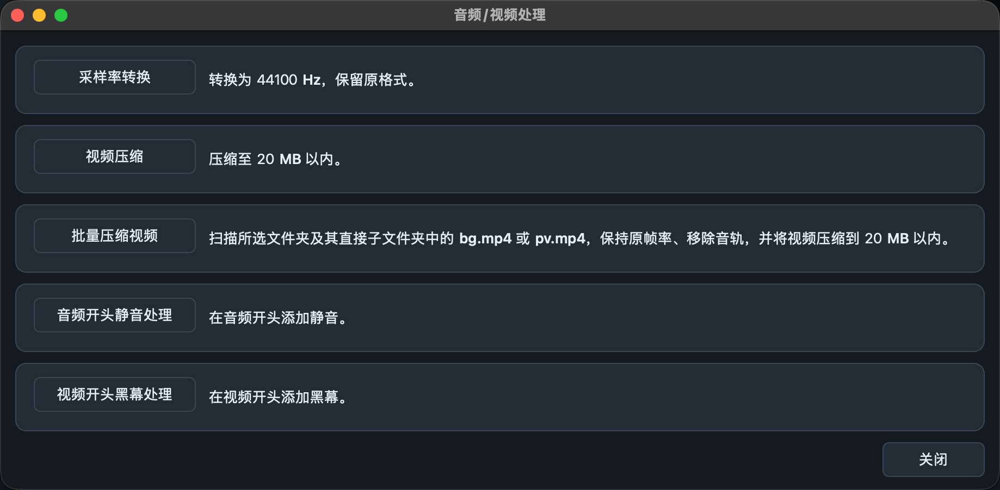
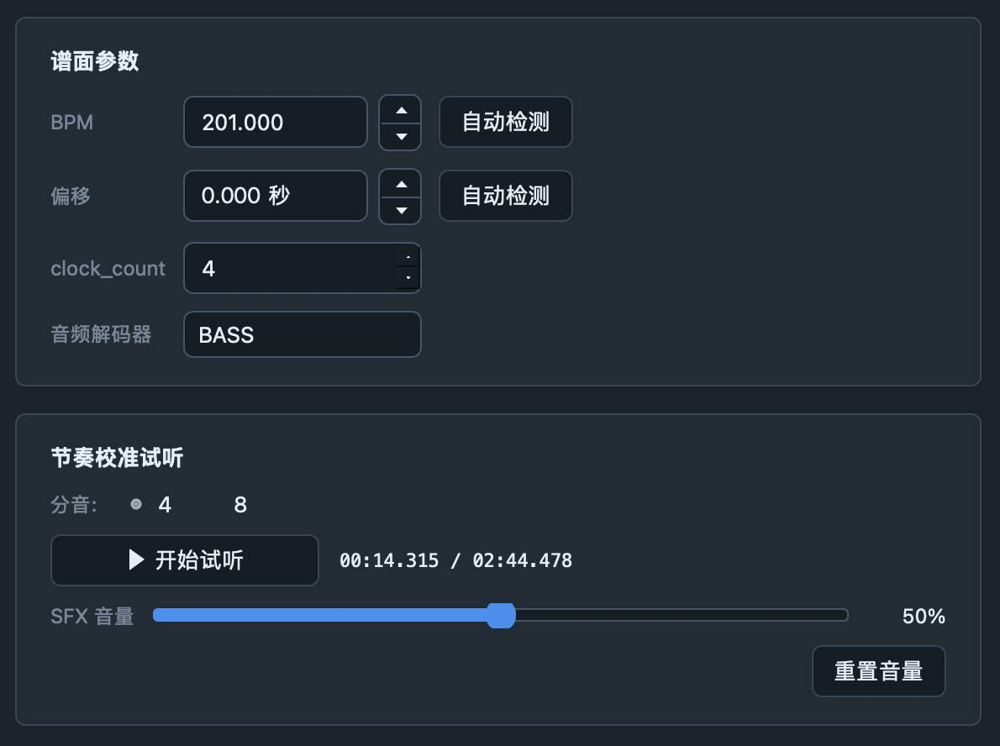

<p align="center">
  
</p>

# MiaCode

[中文](README.md) | [English](README_EN.md)

<p align="center">
  
  
</p>

MiaCode 是一款基于 Qt 6 / C++ 的 maimai 谱面创作工具。集成丰富功能与多平台支持。

## 功能介绍

### 特色

- 支持 Windows、Apple 芯片的 macOS 和 Linux。

- 多组件宽度自由调节，编辑器与预览区面板可左右交换重排。

- 深、浅色主与中 / 英 / 日三种语言支持。

- 键入修改实时更新，无需处于播放模式，可随时拖拽进度条查看配置。

### 语法与无理

<p align="center">
  
  
</p>


支持谱面语法检查，与谱面无理配置检测工具与对应的预览模式，可快速跳转到指定行。
### 视频与封面

<p align="center">
  
  
</p>

#### 导出

导出包含片头与全景 PV 的预览视频。

支持自定义导出区间，或直接在编辑器内选择谱面段落区间并套用。

#### 封面

导出用于发布谱面视频的平台封面。

支持自定义字体、背景等样式，也可以叠加谱面帧截图，用于展示配置。


### 更多实用小功能：

<p align="center">
  
  
  
  
</p>

- 自定义背景


- 输入法禁止与全角字符转换
- 书签跳转段落
- 快捷编写 Touch 音符
- 自动补全时值
- 谱面整理

- 音视频工具
- BPM 与延迟检测

## 构建

### 依赖

- CMake 3.21+
- C++20 编译器
- Qt 6.8+

更详细的打包说明见 [scripts/README.md](scripts/README.md)。

### Windows

使用一键脚本自动安装 Qt、准备依赖、构建并打包：

```powershell
powershell -ExecutionPolicy Bypass -File .\scripts\build\build-win.ps1
```

### macOS

## 仓库结构

- [src](src)：应用源码
- [assets](assets)：运行资源、素材与生成数据
- [resources](resources)：Qt resource collection
- [scripts](scripts)：构建与维护脚本
- [third_party](third_party)：第三方依赖
- [docs](docs)：文档
- [samples](samples)：规格测试示例资源

## 许可证与鸣谢

MiaCode 自有源代码使用 MIT License，见 [LICENSE](LICENSE)。仓库整体、随仓库分发的资源、打包产物和发布包定位为非商业使用；具体边界见 [LICENSE_SCOPE.md](LICENSE_SCOPE.md)。第三方库、字体、音效、图片、FFmpeg、BASS、Qt 以及参考实现可能有各自的许可证或分发限制，请以 [THIRD_PARTY_NOTICES.md](THIRD_PARTY_NOTICES.md) 为准。

感谢 [Minepig/MaiMuriDX](https://github.com/Minepig/MaiMuriDX) 等项目提供的 simai 解析、预览和工程实现参考。感谢 [gfdfdxc/maimai-transition](https://github.com/gfdfdxc/maimai-transition) 提供片头参考。感谢 [Majdata Net](https://majdata.net/) 提供社区谱面下载，感谢 [MaiViewer](https://www.maiviewer.net/) 提供官方谱面 simai 抄谱参考。

特别感谢 hitomi 老师无偿提供 MiaCode logo 绘制。

感谢内部测试时期给出建议、复现问题和协助调试的朋友们，名单见 [ACKNOWLEDGEMENTS.md](ACKNOWLEDGEMENTS.md)。
## 社群

QQ 群：1095435375

<p align="center">
  
</p>
